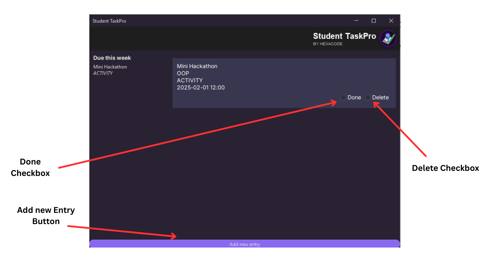
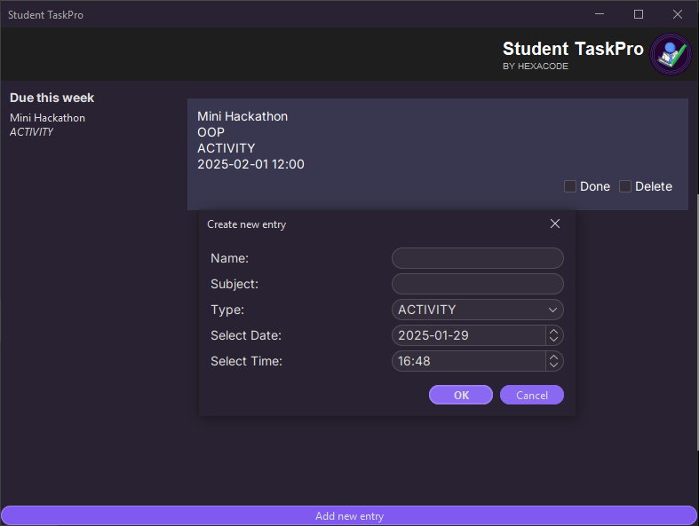

# Student TaskPro

<p align="center">
    
</p>

Student TaskPro a student-focused to-do list application designed 
to help all students manage their academic responsibilities effectively. 
It enables the students to input their specific academic tasks and 
classify them by their respective deadlines. The overall central design 
of this software is prioritization, in which aims to assist the students 
to set priority to their to-do tasks while keeping emphasis on the most 

## Features

- **Todo Entry Prioritization**. Assign deadlines and order tasks based 
on when they need to be completed.

- **User-Friendly Interface**. Easy-to-use software interface designed 
for students to organize and manage their academic tasks efficiently.

- **Progress Tracking**. This program keeps the user updated to ensure 
tasks are completed on time and deadlines are met.

- **Task Categorization**. This program organizes tasks by priority, 
deadline, and type to keep you on track. Tasks are sorted by priority, 
helping you focus on what needs to be done first. They are also 
categorized by deadline, such as urgent or this week, so you know what 
to complete first. Lastly, tasks are grouped by type—Activity, Exam, 
Review, etc.—so you can easily focus on the right kind of work.

## Installation

### Executable Binary
Get the latest binary release at the 
[Releases](https://github.com/karllogdat/hexacode-student-tp/releases) 
page.

### Source Code

Alternatively, you can clone this repository using (if you have maven):

```bash
git clone https://github.com/karllogdat/hexacode-student-tp
cd hexacode-student-tp
mvn clean compile exec:java
```

## How to Use

<p align="center">
    
</p>

<p align="center">
    
</p>

1. Add new entries using the `Add new entry` button or using the shortcut
   `Alt + A`.
   - When adding entries, make sure that: `Name` and `Subject` is not empty,
     and the date and time is after the current time. Holding the `Alt` button
     shows the shortcuts for focusing text fields.

2. Mark entries as done using the `Done` checkbox. Entries marked as done
   are grayed out.
   - When closing the app, entries marked as done are not saved.

3. Delete entries using the `Delete` checkbox. Deleted entries are
   unrecoverable.

4. Closing the app saves the list, so you can get back the entries when
   opening a new session.

## Contributors

<p align="center">
    
</p>
